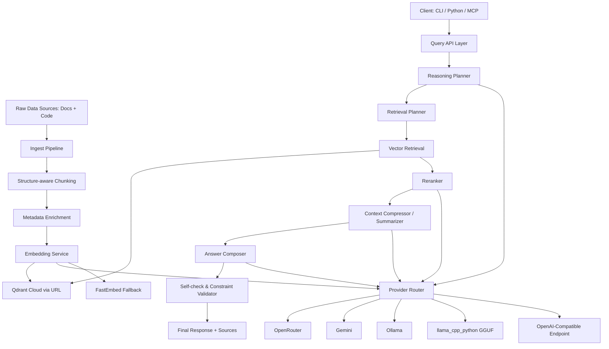
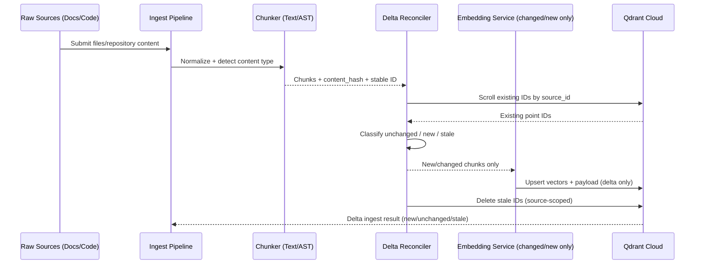
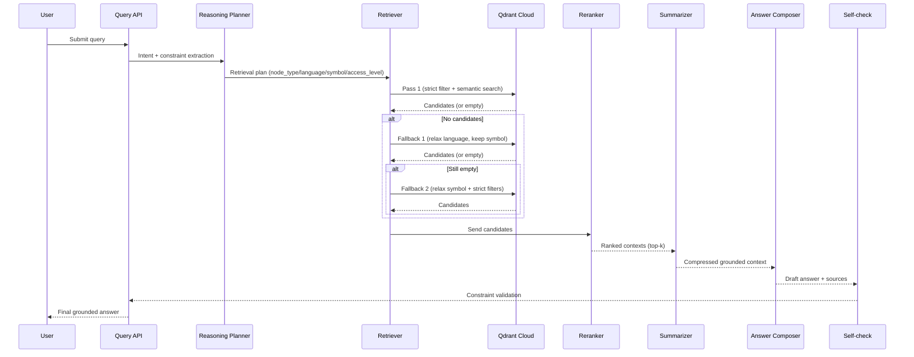

# agentRAG - Brain Memory for AI Agents

## Informasi Proyek

***Nama Proyek:** agentRAG

***Tujuan Utama:** Membangun brain memory berbasis vektor yang mampu memberikan konteks akurat dari dokumen teks (FAQ, panduan) dan *source code* secara bersamaan tanpa merusak struktur atau makna.

***Target Pengguna:**

  -**CLI Tool** - Command-line interface untuk ingest dan query

  -**Python Module** - Library yang bisa diimport dan digunakan dalam aplikasi Python

  -**MCP Server** - Model Context Protocol server untuk integrasi dengan AI agents (Claude, Kiro, dll)

## Business Context

### Problem Statement

Sistem saat ini kesulitan memberikan konteks yang akurat dari kombinasi dokumen teks dan source code, mengakibatkan:

-**Halusinasi AI** - LLM memberikan jawaban yang salah karena tidak tahu tentang custom code/fungsi yang dibuat developer

-**Knowledge Gap** - AI yang dilatih dengan data publik tidak mengenal codebase internal atau fungsi custom

- Waktu respon layanan pelanggan yang lambat
- Developer kesulitan menemukan informasi relevan dari codebase
- Redundansi dokumentasi dan kode

### Value Proposition

agentRAG memberikan:

-**Mengurangi Halusinasi** - Memberikan konteks faktual dari codebase sehingga AI tidak mengarang jawaban

-**Custom Code Awareness** - AI bisa memahami fungsi/class custom yang tidak ada di training data

-**Akurasi Konteks** - Retrieval yang tepat dari teks dan kode

-**Efisiensi Resource** - Berjalan optimal di 2GB RAM, 2 Core CPU

-**Scalability** - Arsitektur yang bisa dikembangkan ke cloud

-**Cost Effective** - Arsitektur cloud-only mengurangi biaya operasional infrastruktur lokal

### Target Market

- Startup dengan resource terbatas
- Perusahaan dengan codebase legacy
- Tim developer yang butuh knowledge management
- Layanan pelanggan dengan knowledge base kompleks

### Competitive Advantage

-**Hallucination Reduction** - Grounding AI responses dengan data faktual dari codebase

-**Beyond Training Data** - AI bisa memahami custom code yang tidak pernah dilihat saat training

-**Multi-Interface** - CLI, Python Module, dan MCP Server dalam satu package

-**Resource Efficiency** - Berjalan di hardware terbatas

-**Cloud-Native Architecture** - Fully managed via cloud URL endpoint

-**AST-aware Processing** - Pemahaman struktur kode yang mendalam

-**Zero Data Retention** - Privacy-focused approach

-**Agent-Ready** - Native support untuk AI agent integration via MCP

## Project Management

### Timeline & Milestones

#### Phase 1: Foundation (2-3 minggu)

- [ ] Core architecture design
- [ ] Qdrant cloud setup via URL
- [ ] Basic text processing pipeline
- [ ] Simple code parser implementation

#### Phase 2: Core Features (3-4 minggu)

- [ ] AST-based chunking for code
- [ ] Delimiter chunking for text
- [ ] Embedding model integration
- [ ] Vector database operations

#### Phase 3: Optimization (2-3 minggu)

- [ ] Performance tuning for 2GB/2Core
- [ ] Memory management optimization
- [ ] Query processing optimization
- [ ] Testing and validation

#### Phase 4: Deployment (1-2 minggu)

- [ ] Documentation completion
- [ ] Deployment scripts
- [ ] User guide creation
- [ ] Handover and training

### Dependencies & Integration

#### External Dependencies

-**Qdrant Client** - Vector database operations

-**sentence-transformers** - Embedding generation

-**Tree-sitter** - Code parsing (via LangChain)

-**LangChain/LlamaIndex** - RAG framework

#### Integration Points

-**File System** - Document ingestion

-**API Endpoints** - Query interface

-**Logging System** - Monitoring and debugging

-**Configuration Management** - Environment setup

## Risk Assessment & Mitigation

### Technical Risks

| Risk | Impact | Probability | Mitigation |

|------|--------|-------------|------------|

| Memory overflow on large documents | High | Medium | Chunk size limits, streaming processing |

| Embedding model performance degradation | Medium | High | Model quantization, batch processing |

| Qdrant database corruption | High | Low | Regular backups, data validation |

| CPU bottleneck on complex queries | Medium | Medium | Query optimization, caching |

### Business Risks

| Risk | Impact | Probability | Mitigation |

|------|--------|-------------|------------|

| Project timeline delays | High | Medium | Agile methodology, buffer time |

| Resource constraints limiting features | Medium | High | MVP approach, incremental development |

| Integration issues with existing systems | Medium | Low | API design, compatibility testing |

| User adoption challenges | Low | Medium | Training, documentation, support |

### Mitigation Strategies

-**Technical**: Modular architecture, comprehensive testing, performance monitoring

-**Project**: Regular sprints, stakeholder communication, risk tracking

-**Business**: User feedback loops, iterative improvements, support systems

## Testing Strategy

### Testing Levels

#### Unit Testing

-**Model Testing** - Embedding generation, vector operations

-**Parser Testing** - AST extraction, text processing

-**Database Testing** - CRUD operations, query performance

-**Utility Testing** - Helper functions, data transformations

#### Integration Testing

-**Pipeline Testing** - End-to-end ingestion process

-**API Testing** - Query interface, error handling

-**Performance Testing** - Load testing, stress testing

-**Security Testing** - Access control, data validation

#### Performance Testing

-**Resource Usage** - Memory, CPU, disk I/O

-**Query Latency** - Response time under load

-**Throughput** - Queries per second

-**Scalability** - Performance with increasing data

### Test Cases

#### Functional Test Cases

1.**Document Ingestion** - Various file formats, large files

2.**Code Parsing** - Different programming languages, complex structures

3.**Query Processing** - Text queries, code queries, mixed queries

4.**Vector Operations** - Similarity search, filtering, pagination

#### Non-Functional Test Cases

1.**Performance** - 2GB/2Core optimization, latency targets

2.**Reliability** - Uptime, error recovery, data consistency

3.**Security** - Authentication, authorization, data protection

4.**Usability** - API design, error messages, documentation

## Operations & Maintenance

### Deployment Strategy

#### Environment Setup

-**Development** - Local WSL, debugging tools

-**Staging** - Resource-limited environment, integration testing

-**Production** - Optimized configuration, monitoring setup

#### Monitoring & Alerting

-**Resource Monitoring** - Memory usage, CPU utilization, disk space

-**Performance Metrics** - Query latency, throughput, error rates

-**Health Checks** - Service availability, database connectivity

-**Log Analysis** - Error patterns, performance bottlenecks

#### Backup & Recovery

-**Data Backup** - Regular snapshots, incremental backups

-**Configuration Backup** - Environment settings, model parameters

-**Disaster Recovery** - Failover procedures, data restoration

-**Rollback Procedures** - Version control, deployment rollback

### Maintenance Procedures

#### Regular Maintenance

-**Database Maintenance** - Index optimization, cleanup

-**Model Updates** - Embedding model updates, parameter tuning

-**Security Updates** - Dependency updates, vulnerability patches

-**Performance Tuning** - Query optimization, resource allocation

#### Troubleshooting Procedures

-**Issue Diagnosis** - Log analysis, performance profiling

-**Root Cause Analysis** - Problem identification, impact assessment

-**Resolution Planning** - Fix development, testing, deployment

-**Post-Mortem** - Lessons learned, preventive measures

## Documentation & Training

### Technical Documentation

#### Architecture Documentation

-**System Overview** - High-level architecture, component interactions

-**API Documentation** - Endpoints, request/response formats, error codes

-**Configuration Guide** - Environment setup, parameter tuning

-**Deployment Guide** - Installation, configuration, deployment procedures

#### User Documentation

-**User Guide** - Getting started, common workflows, best practices

-**API Reference** - Detailed API specifications, examples

-**Troubleshooting Guide** - Common issues, solutions, FAQ

-**Maintenance Guide** - Backup procedures, monitoring, updates

### Training Materials

#### Developer Training

-**Code Examples** - Sample implementations, use cases

-**Best Practices** - Performance optimization, error handling

-**Advanced Topics** - Custom embeddings, model fine-tuning

-**Integration Patterns** - Common integration scenarios

#### User Training

-**Quick Start Guide** - Basic usage, common tasks

-**Advanced Features** - Complex queries, customization options

-**Troubleshooting** - Common problems, solutions

-**Best Practices** - Performance tips, security considerations

## Success Metrics & KPIs

### Business Metrics

-**User Adoption** - Active users, usage frequency

-**Time Savings** - Reduction in search time, improved productivity

-**Cost Reduction** - Decreased API costs, infrastructure savings

-**Customer Satisfaction** - Feedback scores, support ticket reduction

### Technical Metrics

-**Performance** - Query latency (<1s target), throughput (50 queries/minute)

-**Reliability** - Uptime percentage, error rate

-**Resource Efficiency** - Memory usage (<500MB target), CPU utilization

-**Scalability** - Data growth handling, query volume capacity

### Quality Metrics

-**Accuracy** - Retrieval relevance, context precision

-**Completeness** - Coverage of knowledge base, code repository

-**Consistency** - Response uniformity, error handling

-**Security** - Access control compliance, data protection

## Security & Privacy (Enhanced)

### Threat Modeling

-**Data Breaches** - Unauthorized access, data exfiltration

-**Denial of Service** - Resource exhaustion, service disruption

-**Injection Attacks** - Malicious queries, code injection

-**Privacy Violations** - Data leakage, unauthorized processing

### Security Controls

-**Authentication** - API keys, user authentication

-**Authorization** - Role-based access, permission levels

-**Encryption** - Data at rest, data in transit

-**Audit Logging** - Access tracking, change history

### Compliance Considerations

-**GDPR** - Data protection, user rights, data localization

-**Industry Standards** - Security best practices, compliance frameworks

-**Data Retention** - Policy enforcement, automatic cleanup

-**Incident Response** - Breach procedures, notification requirements

## Future Enhancements

### Phase 1 Enhancements (Post-Release)

-**Advanced Query Processing** - Natural language understanding, context awareness

-**Multi-Modal Support** - Images, audio, video content

-**Real-time Updates** - Live document processing, incremental indexing

-**Advanced Analytics** - Usage patterns, performance insights

### Phase 2 Enhancements (Long-term)

-**Distributed Architecture** - Horizontal scaling, load balancing

-**Advanced Machine Learning** - Custom model training, fine-tuning

-**Enterprise Features** - Advanced security, compliance tools

-**Ecosystem Integration** - Third-party tools, platform integrations

## Conclusion

agentRAG dirancang untuk memberikan solusi brain memory yang efisien dan efektif dengan fokus pada:

-**Resource Efficiency** - Optimalisasi untuk 2GB RAM, 2 Core CPU

-**Cloud-Native Architecture** - Operasional terpusat via cloud URL

-**Privacy-First Design** - Zero data retention, security compliance

-**Scalability** - Arsitektur yang bisa dikembangkan sesuai kebutuhan

-**Multi-Interface** - CLI, Python Module, dan MCP Server untuk berbagai use case

Dengan pendekatan yang komprehensif ini, agentRAG akan menjadi solusi brain memory yang robust dan sustainable untuk AI agents dengan support penuh untuk CLI, Python Module, dan MCP Server.

## Ruang Lingkup (Scope)

### In Scope

**Pipeline**ingestion* untuk file teks (Markdown/TXT) dan file kode (Python/C++/dll)

* Implementasi AST-based chunking untuk kode
* Implementasi Delimiter/Safeword chunking untuk teks
* Penyimpanan dan *indexing* vektor menggunakan Qdrant

**Payload-based filtering* berdasarkan bahasa pemrograman atau jenis dokumen

***Grounding mechanism** untuk mengurangi halusinasi AI dengan konteks faktual

***Custom code snippet retrieval** untuk fungsi/class yang tidak ada di training data LLM

### Out of Scope

* Pembuatan UI/UX *frontend*

**Fine-tuning* LLM dari nol

* Optimasi performa untuk dataset sangat besar (>1GB)

***Training ulang model** - agentRAG hanya menyediakan konteks, bukan melatih model

## Spesifikasi Teknis (Tech Stack)

### Environment

***OS:** WSL (Ubuntu)

***Python:** 3.10+

***Database:** Qdrant Cloud via URL Endpoint

***Resource Limit:** 2GB RAM, 2 Core CPU

### Framework & Library

***RAG Framework:** LangChain atau LlamaIndex

***Code Parser:** Tree-sitter (via LangChain)

***Embedding Model:** sentence-transformers (CPU-only, no CUDA/GPU dependencies)

***Vector Database:** Qdrant Client (Cloud URL only)

***Dependency Strategy:** CPU-only packages untuk efisiensi resource terbatas

## Qdrant: Cloud via URL

### Konsep

Qdrant menggunakan **managed cloud endpoint** melalui URL. Tidak ada penyimpanan lokal pada mesin aplikasi; seluruh data vektor disimpan di Qdrant Cloud.

### Keunggulan

***Zero Local Storage** - Tidak ada database lokal di mesin aplikasi

***Managed Operations** - Backup, availability, dan durability dikelola cloud provider

***Simple Connectivity** - Cukup URL + API key untuk koneksi

***Scalable** - Kapasitas storage dan query dapat ditingkatkan sesuai kebutuhan

### Implementasi

```python

from qdrant_client import QdrantClient


# MODE CLOUD ONLY (wajib via URL)
client = QdrantClient(
    url="https://xyz-cluster.eu-central.aws.cloud.qdrant.io:6333",
    api_key="API_KEY_ANDA"
)


# Operasi database

client.create_collection(...)

client.upsert(...)

client.search(...)

```

### Resource Usage

***App Memory Footprint:** Minimal, karena data vektor tidak disimpan lokal

***Cloud Mode:** Seluruh data di Qdrant Cloud

***Storage:** Managed cloud storage

### Resource Constraints

***No GPU Required** - Semua embedding via API, tidak ada dependency GPU

***Memory Efficient** - Embedding via API call, minimal memory usage

***Low Latency** - Target <1s per query (tergantung API response time)

***Scalable** - Bisa dijalankan di mesin dengan resource terbatas

***API-First with Optional Local Fallback** - Default menggunakan provider API; local provider (Ollama/FastEmbed) hanya untuk fallback/resilience

### Embedding Flexibility

***OpenAI-Compatible API** - OpenAI, Azure OpenAI, atau compatible services

***Local Services** - Ollama, LM Studio, LocalAI

***API Compatible** - Format OpenAI API untuk semua layanan

## Environment Configuration (.env)

Gunakan konfigurasi berikut sebagai baseline untuk deployment cloud + reasoning/summarizer pipeline:

```env
# Qdrant Configuration
QDRANT_URL=https://qdrant.geekscodebase.me
QDRANT_API_KEY=your_qdrant_api_key_here
DEFAULT_TOP_K_MEMORY_QUERY=3

# Embedding Configuration
# Options: openrouter, gemini, ollama, fastembed, llama_cpp_python (default fallback: fastembed)
EMBEDDING_PROVIDER=openrouter
EMBEDDING_MODEL=qwen/qwen3-embedding-8b

# Summarizer Configuration
# Options: openrouter (default), gemini, ollama, llama_cpp_python
SUMMARIZER_PROVIDER=openrouter
SUMMARIZER_MODEL=openai/gpt-oss-20b:free

# Reasoning Configuration
# Options: openrouter, gemini, ollama, llama_cpp_python (OpenAI-compatible supported)
ENABLE_REASONING=true
REASONING_PROVIDER=openrouter
REASONING_MODEL=openai/gpt-oss-20b:free
REASONING_MAX_STEPS=3

# Reranker Configuration
# Options: fastembed, openrouter, gemini, ollama, llama_cpp_python (OpenAI-compatible supported)
ENABLE_RERANKER=true
RERANKER_PROVIDER=fastembed
RERANKER_MODEL=BAAI/bge-reranker-v2-m3
RERANK_CANDIDATES=20
FINAL_TOP_K=3

# llama-cpp-python Local GGUF Paths (Optional)
LLAMA_CPP_EMBED_MODEL_PATH=./models/nomic-embed-text-v2-moe.Q4_K_M.gguf
LLAMA_CPP_RERANKER_MODEL_PATH=./models/gte-multilingual-reranker-base-Q4_K_M.gguf
LLAMA_CPP_SUMMARIZER_MODEL_PATH=./models/Qwen3.5-0.8B-Q4_K_M.gguf
LLAMA_CPP_REASONING_MODEL_PATH=./models/reasoning-0.5b-q4_k_m.gguf

# Provider API Keys / Endpoints
OPENROUTER_API_KEY=your_openrouter_key_here
GEMINI_API_KEY=your_gemini_key_here
OLLAMA_API_URL=http://localhost:11434
OLLAMA_API_KEY=

# OpenAI-Compatible Endpoint (Optional)
# Bisa diarahkan ke provider lain atau local gateway yang kompatibel OpenAI API
OPENAI_COMPATIBLE_BASE_URL=
OPENAI_COMPATIBLE_API_KEY=
```

### Provider Selection

***OpenRouter (Recommended)**  
Best untuk embedding: `qwen/qwen3-embedding-8b`  
Best untuk summarization: `openai/gpt-oss-20b:free`  
Butuh API key dari openrouter.ai  
Menggunakan OpenAI-compatible SDK/headers

***Gemini**  
Bagus untuk embedding dan summarization  
Tersedia free tier  
API key dari Google AI Studio

***Ollama**  
Local, gratis, privacy-focused  
Butuh Ollama service berjalan di endpoint `OLLAMA_API_URL`  
Bisa self-hosted/cloud Ollama via API key  
Contoh model: `nomic-embed-text:v1.5` (embedding), `llama2` (summarization)

***FastEmbed (Fallback)**  
Embedding lokal  
Tanpa API key  
Dipakai sebagai fallback otomatis saat provider embedding utama gagal

***llama-cpp-python (Local GGUF)**  
Menjalankan model lokal berbasis file `.gguf` tanpa API eksternal  
Path model diatur via:
`LLAMA_CPP_EMBED_MODEL_PATH`, `LLAMA_CPP_RERANKER_MODEL_PATH`, `LLAMA_CPP_SUMMARIZER_MODEL_PATH`, `LLAMA_CPP_REASONING_MODEL_PATH`  
Contoh:
`nomic-embed-text-v2-moe.Q4_K_M.gguf`, `gte-multilingual-reranker-base-Q4_K_M.gguf`, `Qwen3.5-0.8B-Q4_K_M.gguf`, `reasoning-0.5b-q4_k_m.gguf`

***OpenAI-Compatible (Local/Custom Provider)**  
Mendukung endpoint yang kompatibel dengan OpenAI API (mis. local gateway, provider pihak ketiga, self-hosted)  
Bisa dipakai untuk reasoning/summarizer/reranker selama format API kompatibel  
Konfigurasi via `OPENAI_COMPATIBLE_BASE_URL` dan `OPENAI_COMPATIBLE_API_KEY`

### Runtime Policy (Recommended)

1. Primary provider: `openrouter` untuk embedding + summarizer
2. Fallback embedding: `fastembed` jika koneksi provider eksternal gagal
3. Reasoning aktif saat `ENABLE_REASONING=true`, maksimal langkah mengikuti `REASONING_MAX_STEPS`
4. Reranking aktif saat `ENABLE_RERANKER=true`, kandidat awal `RERANK_CANDIDATES`, output akhir `FINAL_TOP_K`
5. Fallback summarizer/reasoning/reranker: retry ke provider kedua (`gemini`, `ollama`, atau `llama_cpp_python`) jika timeout/error
6. Semua provider error: kembalikan context retrieval mentah (tanpa summarizer) agar sistem tetap responsif

### Arsitektur



### Arsitektur Komponen (Ringkas)

1. Ingest Layer: normalisasi data, chunking teks/kode, enrichment metadata
2. Retrieval Storage: Qdrant Cloud URL sebagai vector store utama
3. Query Intelligence: reasoning planner + retrieval planner + self-check
4. Relevance Layer: reranker untuk meningkatkan precision context
5. Synthesis Layer: summarizer/compressor + answer composer grounded
6. Provider Router: cloud/local/openai-compatible + fallback policy

## Model Embedding & Summarizer

### Default (Production Recommendation)

* Embedding Provider: `openrouter`
* Embedding Model: `qwen/qwen3-embedding-8b`
* Summarizer Provider: `openrouter`
* Summarizer Model: `openai/gpt-oss-20b:free`

### Supported Providers

* `openrouter` - Primary untuk embedding + summarizer (recommended)
* `gemini` - Alternatif untuk embedding + summarizer
* `ollama` - Opsi local/self-hosted
* `llama_cpp_python` - Opsi local GGUF untuk embedding/reranker/reasoning
* `fastembed` - Embedding fallback lokal tanpa API key

### Selection Criteria

* Kualitas embedding untuk kode vs teks
* Grounding quality pada summarization
* Biaya per token (cloud services)
* Latency requirements
* Privacy dan compliance requirements
* Kompatibilitas OpenAI-compatible API

### Fallback Policy

* Embedding gagal di provider utama -> fallback ke `fastembed`
* Summarizer/reasoning/reranker timeout/error -> retry ke provider kedua (`gemini`, `ollama`, atau `llama_cpp_python`)
* Jika semua summarizer gagal -> kirim context retrieval mentah (tanpa summarizer)

## Struktur Payload Collection

### Universal Node Structure

```json

{

  "id": "uuid-deterministik-dari-hash(source_id + content_hash)",

  "vector": [0.123, -0.456, ...],

  "payload": {

    // --- ROOT FIELDS (Wajib ada di semua Node) ---

    "node_type": "text", // "text" atau "code"

    "content": "Isi teks atau source code di sini...",

    "content_hash": "a1b2c3d4e5f6...", // Hash isi chunk (deteksi perubahan)

    "source_id": "finance-analytics/src/metrics.py", // Pengganti document_id / file_path

    "chunk_index": 5,

    "parent_node_id": "repo_456_file_7",

    "hierarchy_path": "src/finance/metrics.py > calculate_roi",

    "access_level": "internal", // public, internal, admin

  

    // --- TEXT METADATA (Hanya diisi jika node_type == "text", sisanya null) ---

    "text_metadata": {

      "document_type": "markdown",

      "section": "Installation Guide",

      "author": "Tim DevOps"

    },


    // --- CODE METADATA (Hanya diisi jika node_type == "code", sisanya null) ---

    "code_metadata": {

      "language": "python",

      "ast_type": "FunctionDef", // Bisa FunctionDef, ClassDef, Import

      "symbol_name": "calculate_roi",

      "line_start": 45,

      "line_end": 47,

      // Field opsional di bawah ini disatukan saja

      "base_classes": null, // Diisi jika ClassDef

      "methods": null,      // Diisi jika ClassDef

      "parameters": [       // Diisi jika FunctionDef

        {"name": "gain", "type": "float"}

      ],

      "calls": ["validate_input"],

      "docstring": "Calculate ROI given gain and cost"

    },


    // --- GLOBAL METADATA ---

    "metadata": {

      "last_modified": "2024-02-15T10:30:00Z",

      "indexed_at": "2026-03-06T19:00:00Z"

    }

  }

}

```

### Key Fields

| Field | Deskripsi | Node Types |

|-------|-----------|------------|

| `node_type` | text atau code | All |

| `content` | Konten asli | All |

| `content_hash` | Hash isi chunk untuk deteksi perubahan | All |

| `source_id` | ID sumber (file/repo) | All |

| `chunk_index` | Urutan chunk | All |

| `hierarchy_path` | Path hierarki lengkap | All |

| `access_level` | Tingkat akses keamanan | All |

| `text_metadata` | Metadata khusus teks | text only |

| `code_metadata` | Metadata khusus kode | code only |

| `metadata` | Metadata global | All |

### Keunggulan Skema Universal

1.**Uniformity** - Satu template untuk semua jenis data

2.**Efficiency** - Filtering hanya butuh satu field

3.**Security** - Access control terintegrasi

4.**Performance** - Delta re-index minim write/delete yang tidak perlu

5.**Scalability** - Mudah diperluas untuk fitur baru

6.**Python Compatibility** - Cocok untuk Pydantic validation

### Query Flexibility

Dengan skema ini, query di Qdrant menjadi sangat elegan:

```python

# Contoh query: Cari potongan teks "cara instalasi" di dokumen internal

query = {

    "filter": {

        "must": [

            {"key": "node_type", "match": {"keyword": "text"}},

            {"key": "text_metadata.section", "match": {"keyword": "Installation Guide"}},

            {"key": "access_level", "match": {"keyword": "internal"}}

        ]

    },

    "vector": {

        "values": [0.123, -0.456, ...],

        "filter": {"key": "node_type", "match": {"keyword": "text"}}

    }

}

```

### Implementation Benefits

1.**Single Data Model** - Satu Pydantic class untuk semua node

2.**Simplified Logic** - Tidak perlu IF/ELSE untuk filtering

3.**Performance** - Content hash menghemat komputasi

4.**Security** - Access control terintegrasi

5.**Maintainability** - Mudah ditambah fitur baru

### Resource Optimization

Skema ini dirancang untuk:

-**Memory Efficiency** - Hanya field yang diperlukan yang diisi

-**CPU Optimization** - Hash calculation hanya sekali

-**Storage Optimization** - Tidak ada redundant data

-**Query Performance** - Filtering hanya butuh satu field

### Future Extensions

Skema ini bisa dengan mudah diperluas untuk:

-**Multi-language Support** - Field `language` di root level

-**Version Control** - Field `version` untuk tracking

-**Collaboration** - Field `contributors` untuk multi-author

-**Analytics** - Field `usage_stats` untuk monitoring

### Migration Strategy

Untuk migrasi dari skema lama ke skema baru:

1.**Phase 1** - Tambahkan field baru tanpa hapus yang lama

2.**Phase 2** - Mulai gunakan field baru untuk filtering

3.**Phase 3** - Hapus field lama setelah migrasi selesai

4.**Phase 4** - Optimasi query untuk skema baru

### Validation Rules

```python

# Contoh validation rules untuk Pydantic

classRAGPayload(BaseModel):

    node_type: Literal["text", "code"]

    content: str

    content_hash: str

    source_id: str

    chunk_index: int

    parent_node_id: str

    hierarchy_path: str

    access_level: Literal["public", "internal", "admin"]

    text_metadata: Optional[TextMetadata] =None

    code_metadata: Optional[CodeMetadata] =None

    metadata: Metadata

```

### Performance Considerations

-**Indexing Speed** - Content hash calculation overhead minimal

-**Query Performance** - Single field filtering lebih cepat

-**Memory Usage** - Optional fields menghemat space

-**Storage Efficiency** - No redundant data

### Security Implementation

-**Access Control** - `access_level` untuk filtering

-**Data Integrity** - `content_hash` untuk deteksi perubahan

-**Audit Trail** - `metadata` untuk tracking

-**Privacy** - Sensitive data bisa di-filter berdasarkan level

### Testing Strategy

-**Schema Validation** - Pydantic untuk data integrity

-**Performance Testing** - Query performance dengan skema baru

-**Security Testing** - Access control functionality

-**Migration Testing** - Data migration dari skema lama

### Deployment Considerations

-**Backward Compatibility** - Support untuk skema lama sementara

-**Gradual Rollout** - Fase-fase migrasi

-**Monitoring** - Performance metrics untuk skema baru

-**Rollback Plan** - Kembali ke skema lama jika diperlukan

### Documentation Updates

-**API Documentation** - Skema baru untuk payload

-**User Guide** - Cara menggunakan field baru

-**Migration Guide** - Langkah-langkah migrasi

-**Best Practices** - Penggunaan optimal skema baru

### Conclusion

Skema Payload Universal ini memberikan:

-**Simplicity** - Satu template untuk semua data

-**Flexibility** - Mudah diperluas untuk fitur baru

-**Performance** - Optimized untuk resource terbatas

-**Security** - Access control terintegrasi

-**Maintainability** - Mudah dimaintenance dan dikembangkan

Dengan implementasi ini, agentRAG akan memiliki fondasi data yang kuat dan scalable untuk masa depan sebagai brain memory untuk AI agents.

## Data Flow

### End-to-End Workflow (Raw Data -> Qdrant -> Answer)

1. Raw data ingestion (text documents + source code files)
2. Data normalization (clean text, remove separators, standardize encoding)
3. Structure-aware chunking:
   - text: delimiter/section chunking
   - code: AST-based chunking
     - Python: built-in `ast`
     - JavaScript/TypeScript/Go/Java: `tree-sitter` (fallback regex parser jika runtime tree-sitter tidak tersedia)
4. Metadata enrichment per chunk (`source_id`, `chunk_index`, `hierarchy_path`, `access_level`, `content_hash`)
5. Build stable chunk ID: `hash(source_id + content_hash)`
6. Delta re-ingest reconciliation per `source_id`:
   - fetch existing point IDs by `source_id`
   - mark unchanged chunks (ID already exists)
   - upsert only changed/new chunks
   - delete only stale chunks (old IDs not present in current source)
7. Embedding generation for changed/new chunks only
8. Upsert to Qdrant Cloud via URL endpoint (vector + universal payload metadata)
9. Ensure payload index for `source_id` in Qdrant
10. Query intake from CLI/Python module/MCP server
11. Reasoning layer:
   - intent classification (`find_snippet`, `explain_function`, `bug_hunt`, `refactor_guidance`)
   - constraint extraction (language, symbol name, path/module, access scope)
   - retrieval planning (semantic search + metadata filter + keyword fallback)
12. Multi-pass retrieval:
   - Pass 1 (strict): semantic search + metadata filter (`node_type`, `language`, `symbol_name`, `access_level`)
   - Fallback 1: relax `language`, keep `symbol_name`
   - Fallback 2: relax `symbol_name` + strict filters lain bila masih kosong
13. Reranking by semantic relevance + lexical overlap
14. Context compression (top context yang paling informatif)
15. Summarizer/compressor untuk merapikan konteks terpilih tanpa kehilangan fakta penting
16. Answer generation grounded by retrieved context + source references
17. Self-check:
   - validasi apakah constraint query terpenuhi
   - retry retrieval sekali dengan filter lebih ketat jika mismatch

### Workflow Diagram (Ingest Execution)



### Workflow Diagram (Query Execution)



### Ingest Process (Operational)

1. File detection (text/code)
2. Chunking strategy selection
3. Clean text processing (remove separators)
4. Generate `content_hash` per chunk + stable chunk ID (`hash(source_id + content_hash)`)
5. Compare with existing IDs by `source_id` (delta reconciliation)
6. Upsert changed/new chunks only
7. Delete stale chunks only (per `source_id`, bukan delete massal koleksi)
8. Vector storage with metadata (Qdrant Cloud URL)
9. Optional dry-run mode (`agentrag ingest ... --dry-run`) untuk lihat `new/unchanged/stale/skipped` tanpa write

### Query Process (Reasoning + Retrieval)

1. Query preprocessing
2. Intent + constraint extraction
3. Retrieval planning
4. Strict retrieval with metadata filtering (`node_type`, `language`, `symbol_name`, `access_level`)
5. Fallback retrieval bertahap (relax `language` dulu, lalu `symbol_name`)
6. Reranking and context compression
7. Response generation
8. Constraint compliance check

## Performance Metrics

### Target

* Latency: <1s per query (cloud-based)
* Recall: >0.8
* Throughput: 50 queries/minute (cloud-based)
* Memory Usage: <500MB (aplikasi, cloud-based vector storage)
* Constraint Match Rate: >0.9 (hard constraints seperti language/symbol harus terpenuhi)
* Grounded Answer Rate: >0.9 (jawaban memiliki referensi konteks yang valid)
* Delta Re-ingest Write Reduction: >70% pada re-ingest berulang (dibanding full rewrite)
* Unchanged Chunk Ratio: >60% untuk re-ingest rutin pada source stabil
* Stale Delete Latency: p95 <500ms per 1.000 stale IDs (source-scoped)
* Source Re-ingest Duration: p95 <3s per file ukuran menengah (<5MB)
* Fallback Hit Recovery: >50% query strict-empty berhasil dapat kandidat setelah fallback bertahap

### Monitoring

* Query success rate
* Average response time
* Memory usage
* Vector database performance
* Retrieval precision@k
* Constraint compliance rate
* Retry rate from self-check stage
* Ingest counters: `new_chunks`, `unchanged_chunks`, `stale_deleted`, `skipped`
* Delta efficiency trend: write reduction per re-ingest batch
* Query fallback metrics: strict-empty rate, fallback stage success rate

## Resource Optimization

### Memory Management

* Model quantization (if available)
* Chunk size optimization
* Batch processing
* Lazy loading

## Package Management Strategy: uv vs pip

### Mengapa uv Dipilih untuk agentRAG?

#### 1. Sinergi Ekosistem (Sama-sama Berbasis Rust)

Sama seperti Qdrant yang Anda pilih karena performanya yang ringan, `uv` ditulis menggunakan bahasa **Rust**. Ini membuatnya **10-100x lebih cepat** daripada `pip` dalam menginstal paket dan menyelesaikan dependensi (*dependency resolution*). Ini sangat cocok dengan tema proyek Anda yang mengutamakan *Resource Efficiency*.

#### 2. Reproducibility (Kunci untuk Penggunaan Global)

Masalah terbesar dengan `pip` biasa dan `requirements.txt` adalah fenomena *"it works on my machine"* (jalan di laptop saya, tapi *error* di server orang lain). `uv` memecahkan ini dengan sistem **Lockfile** (`uv.lock`). Jika seorang *developer* di negara lain mengkloning proyek Anda, `uv` menjamin mereka mendapatkan versi pustaka yang 100% sama persis hingga ke level *sub-dependency*.

#### 3. Manajemen Terpadu (All-in-One)

Dengan `pip`, Anda butuh `venv` untuk *virtual environment*, `pip-tools` untuk *lockfile*, dan mungkin `pyenv` untuk versi Python. `uv` melakukan **semuanya sekaligus**. Ia bahkan bisa mengunduh versi Python yang benar secara otomatis jika *user* belum memilikinya!

#### 4. Kompatibilitas dengan Standar Industri

Walaupun `uv` sangat canggih, standar industri dunia saat ini masih `pip`. Oleh karena itu, kita gunakan pendekatan *Hybrid*: **Kita *develop* menggunakan `uv`, namun kita tetap sediakan akses bagi pengguna `pip`.**

#### 5. Lightweight Dependencies

`uv` memungkinkan kita untuk **manage dependencies dengan efisien**, menghindari instalasi package yang tidak perlu. Dengan fokus ke OpenAI-compatible API, kita tidak perlu PyTorch, TensorFlow, atau library ML berat lainnya.

### Strategi Distribusi Global (Hybrid)

Berikut adalah cara transisi proyek kita di WSL ke `uv`:

#### Langkah 1: Instalasi `uv` di WSL

Buka terminal WSL Anda dan jalankan perintah ini:

```bash

curl-LsSfhttps://astral.sh/uv/install.sh|sh

```

*(Tutup dan buka kembali terminal Anda agar perintah `uv` dikenali).*

#### Langkah 2: Inisialisasi Proyek Baru

Di dalam folder `agentRAG`, alih-alih menggunakan `venv` dan `pip` manual, kita biarkan `uv` yang mengaturnya:

```bash

uvinit

```

Ini akan menghasilkan file **`pyproject.toml`**. File ini adalah standar modern pengganti `requirements.txt` untuk distribusi paket Python global (PEP 621).

#### Langkah 3: Menambahkan Dependensi

Sekarang, masukkan semua *library* yang kita butuhkan:

```bash

uvaddqdrant-clientpydanticclickpython-dotenvrichpsutilopenairequests

```

`uv` akan secara otomatis membuat *virtual environment* (`.venv`), mengunduh paket secepat kilat, dan membuat file `uv.lock`.

#### Langkah 4: Jembatan untuk Pengguna Global (`pip` fallback)

Agar *developer* jadul yang hanya tahu `pip` tetap bisa menggunakan proyek Anda, Anda bisa meminta `uv` untuk menghasilkan `requirements.txt` yang super stabil kapan saja dengan perintah:

```bash

uvexport--formatrequirements-txt>requirements.txt

```

Dengan begini, di repositori GitHub Anda nanti, ada `pyproject.toml` (untuk *user* modern/uv) dan `requirements.txt` (untuk *user* klasik/pip). Semua orang senang!

### Kesimpulan

Beralih ke `uv` akan meningkatkan pengalaman pengembangan Anda secara drastis, menghemat memori, dan memastikan proyek agentRAG Anda bisa di-*build* ulang di server mana pun di seluruh dunia tanpa takut *dependency hell* (konflik versi).

### CPU Optimization

* Vector similarity search optimization
* Parallel processing
* Efficient data structures
* Minimal dependencies

### Cloud Optimization

* API rate limiting
* Cost management
* Region selection
* Service level agreements

## Security & Privacy

### Data Handling

* Encryption at rest
* Access control
* Audit logging
* Data retention policies

***Zero Data Retention** - Opt-out dari model training saat menggunakan Cloud LLM API untuk memastikan source code tidak bocor

### Compliance

* GDPR considerations
* Data localization
* User consent management

## MCP Configuration (VS Code / Codex / KiloCode)

### Tujuan

Konfigurasi MCP ini memungkinkan agent client (VS Code, Codex, KiloCode, dll) terhubung ke server `agentRAG` untuk query context, memory retrieval, dan reasoning workflow.

### Environment yang Wajib Tersedia

* `QDRANT_URL`
* `QDRANT_API_KEY`
* `DEFAULT_TOP_K_MEMORY_QUERY`
* `EMBEDDING_PROVIDER`, `EMBEDDING_MODEL`
* `SUMMARIZER_PROVIDER`, `SUMMARIZER_MODEL`
* `ENABLE_REASONING`, `REASONING_PROVIDER`, `REASONING_MODEL`, `REASONING_MAX_STEPS`
* `ENABLE_RERANKER`, `RERANKER_PROVIDER`, `RERANKER_MODEL`, `RERANK_CANDIDATES`, `FINAL_TOP_K`
* `OPENAI_COMPATIBLE_BASE_URL`, `OPENAI_COMPATIBLE_API_KEY`
* `LLAMA_CPP_EMBED_MODEL_PATH`, `LLAMA_CPP_RERANKER_MODEL_PATH`, `LLAMA_CPP_SUMMARIZER_MODEL_PATH`, `LLAMA_CPP_REASONING_MODEL_PATH`

### VS Code (MCP Servers)

```json
{
  "mcpServers": {
    "agentrag": {
      "command": "uv",
      "args": [
        "run",
        "python",
        "-m",
        "agentrag.mcp_server"
      ],
      "env": {
        "QDRANT_URL": "https://qdrant.geekscodebase.me",
        "QDRANT_API_KEY": "your_qdrant_api_key_here",
        "DEFAULT_TOP_K_MEMORY_QUERY": "3",
        "EMBEDDING_PROVIDER": "openrouter",
        "EMBEDDING_MODEL": "qwen/qwen3-embedding-8b",
        "SUMMARIZER_PROVIDER": "openrouter",
        "SUMMARIZER_MODEL": "openai/gpt-oss-20b:free",
        "ENABLE_REASONING": "true",
        "REASONING_PROVIDER": "openrouter",
        "REASONING_MODEL": "openai/gpt-oss-20b:free",
        "REASONING_MAX_STEPS": "3",
        "ENABLE_RERANKER": "true",
        "RERANKER_PROVIDER": "fastembed",
        "RERANKER_MODEL": "BAAI/bge-reranker-v2-m3",
        "RERANK_CANDIDATES": "20",
        "FINAL_TOP_K": "3"
      }
    }
  }
}
```

### Codex Client

```json
{
  "mcpServers": {
    "agentrag": {
      "command": "uv",
      "args": [
        "run",
        "python",
        "-m",
        "agentrag.mcp_server"
      ],
      "envFile": ".env"
    }
  }
}
```

### KiloCode / Client Lain

```json
{
  "mcpServers": {
    "agentrag": {
      "transport": "stdio",
      "command": "uv",
      "args": [
        "run",
        "python",
        "-m",
        "agentrag.mcp_server"
      ],
      "envFile": ".env"
    }
  }
}
```

### Opsi HTTP/SSE (Jika Server Diekspos sebagai Endpoint)

```json
{
  "mcpServers": {
    "agentrag": {
      "transport": "http",
      "url": "http://127.0.0.1:8000/mcp",
      "headers": {
        "Authorization": "Bearer your_mcp_token_here"
      }
    }
  }
}
```

### Catatan Operasional

1. Gunakan `.env` untuk menyimpan secret, jangan hardcode API key di config client
2. Untuk mode lokal penuh, set provider ke `llama_cpp_python` dan isi semua `LLAMA_CPP_*_MODEL_PATH`
3. Untuk mode cloud, gunakan `openrouter`/`gemini` + `OPENAI_COMPATIBLE_*` jika perlu gateway custom
4. Pastikan nilai `FINAL_TOP_K` tidak melebihi `RERANK_CANDIDATES`
